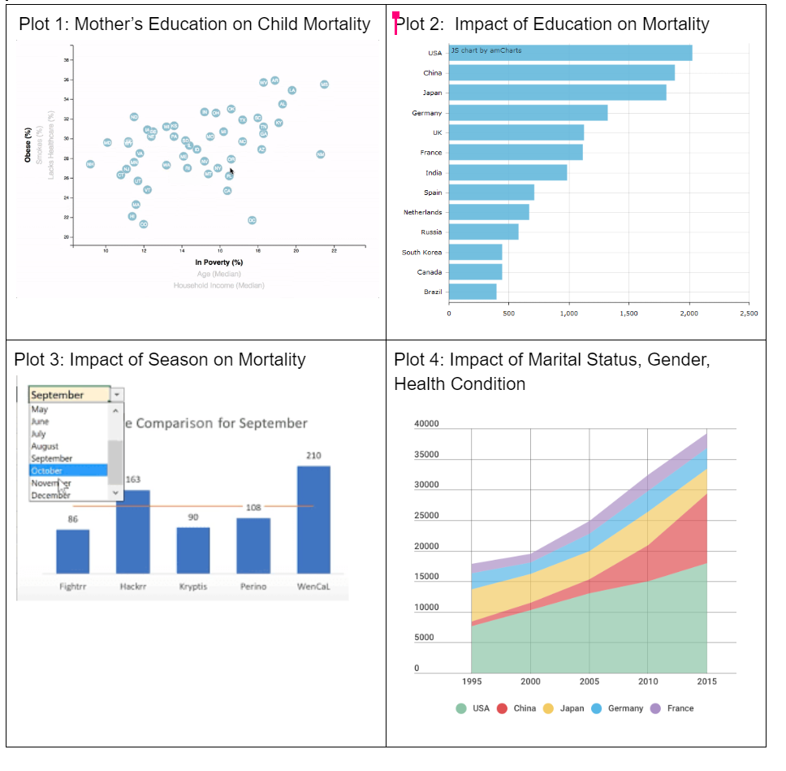

# leading_causes_of_death
Determine greatest causes of death in US from 2005-2015

Our project will analyze mortality in America from 2013 to 2015, specifically with regards to: 
*Seasonal impact on mortality, 
*Women's education impact on child mortality, 
*Impact of college education on mortality, and 
*Impact of marital status, gender and cardiovascular mortality.

By analyzing this topic: our app will identify trends that public health officials will be able to use to optimize future spending to improve public health outcomes. 

Link to data: [https://www.kaggle.com/cdc/mortality?select=2005_codes.json]

Visualization of Dashboard

Plot 1: Mother’s Education on Child Mortality

Plot 2:  Impact of Education on Mortality
Plot 3: Impact of Season on Mortality

Plot 4: Impact of Marital Status, Gender, Health Condition

