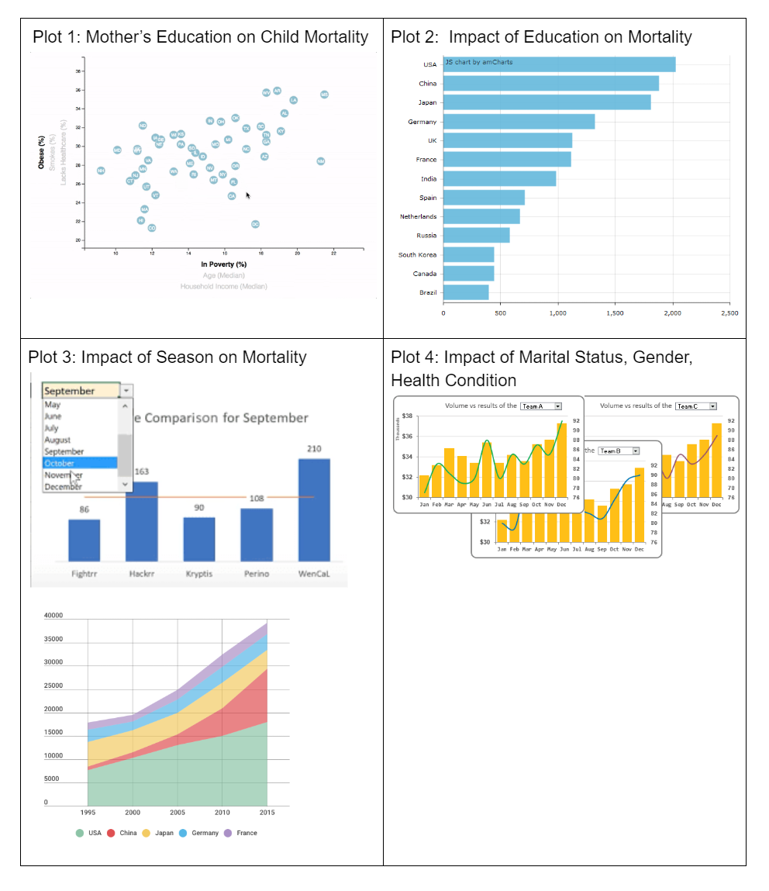

# Proposal
Analyze data for leading causes of death in the US from 2013-2015 to evaluate following hypothesis.

Our project will analyze mortality in America from 2013 to 2015, specifically with regards to: 
* Seasonal impact on mortality.
* Women's education impact on child mortality.
* Impact of college education on mortality.
* Impact of marital status, gender and cardiovascular mortality.

## Hypothesis
* Many causes of death have a clear seasonal pattern.
* As education level increases in women child mortality tends to reduce.

* As education level increases, cancer and heart disease mortality rates will decrease
* An additional year of college decreases mortality rates by 15 to 19 percent by reducing deaths from cancer and heart disease.
* Someone who completed High School, but did not attend college will be higher than those of those who attended some college/bachlors/masters/doctorate. 

* The risk of cardiovascular mortality is greater in single, never married men and separated/divorced women compared with those that are married.

By analyzing this topic: our app will identify trends that public health officials will be able to use to optimize future spending to improve public health outcomes the scenarios. 

Link to data (Centers for Disease Control mortality data): [https://www.kaggle.com/cdc/mortality?select=2005_codes.json]

Visualization of Dashboard (and Inspiring Visualizations)

